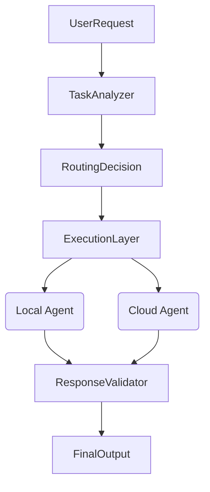

# EdgeRouteAI: Low-Cost Edge-Cloud Model Orchestrator

EdgeRouteAI is a hybrid AI agent orchestration system designed to optimize cost and latency by intelligently routing tasks between local edge devices and cloud-based foundation models.

It leverages **Agno** for multi-agent orchestration, **Ollama** for local inference on edge devices, and **AIsa.one** for powerful cloud fallback when tasks exceed local capabilities.


## 🚀 Key Features

- **Hybrid Intelligence**: Routes simple/fast tasks to local (free) models and complex/reasoning-heavy tasks to the cloud (paid).
- **Complexity Scoring Engine**: Analyzes prompts for token count, instruction depth, and reasoning keywords to assign a complexity score (1-10).
- **Device Awareness**: Automatically detects available local resources (RAM, GPU) and models (via Ollama).
- **Network Awareness**: Capable of checking bandwidth to decide if cloud offloading is feasible (stubbed).
- **Cost Optimization**: Default "Cost Saving Mode" aggressively prefers local execution unless complexity thresholds are breached.
- **Failover & Validation**: Auto-retries on cloud if local models fail or produce low-quality responses (e.g., too short, uncertain).

## 🏗 Architecture

The system uses an agent graph architecture:



## 🛠 Tech Stack

- **Orchestration**: [Agno](https://github.com/agno-agi/agno)
- **Local Inference**: [Ollama](https://ollama.com)
- **Cloud Gateway**: [AIsa.one](https://aisa.one) (OpenAI-compatible)
- **API**: FastAPI
- **Language**: Python 3.10+

## 📦 Components

1.  **Task Analyzer Agent**: Uses heuristics to classify tasks (coding, summary, planning) and estimate tokens.
2.  **Routing Decision Agent**: The "brain" that decides `local` vs `cloud` based on policy config.
3.  **Local Execution Agent**: Wraps Ollama to run models like `gemma3`, `qwen2.5`, `mistral`.
4.  **Cloud Execution Agent**: Connects to AIsa.one for access to GPT-4o, Claude 3.5, etc.
5.  **Response Validator**: Checks output quality and triggers cloud retry if needed.

## 🏃‍♂️ Getting Started

### Prerequisites

- Python 3.10+
- [Ollama](https://ollama.com/) installed and running (`ollama serve`).
- At least one local model pulled (e.g., `ollama pull gemma3:12b` or `qwen2.5:3b`).

### Installation

1.  **Clone the repository**:
    ```bash
    git clone https://github.com/your-repo/EdgeRouteAI.git
    cd EdgeRouteAI
    ```

2.  **Install dependencies**:
    ```bash
    python -m venv venv
    source venv/bin/activate
    pip install -r requirements.txt
    ```

3.  **Configure Environment**:
    Copy `.env.example` to `.env` and add your AIsa.one API key:
    ```bash
    cp .env.example .env
    # Edit .env and set AISA_API_KEY
    ```

### Usage

#### Run the API Server
Start the orchestration server:
```bash
uvicorn edgeroute.main:app --reload
```

#### Run the Demo
You can run the included demo script to test various scenarios. You can specify which local model to prefer:
```bash
python demo.py -m gemma3:12b
```

## 🧪 Testing

Run the unit tests to verify routing logic:
```bash
python -m unittest tests/test_router.py
```

## ⚙️ Configuration

Tune the routing policy in `.env`: or `edgeroute/agents/router.py`:

- `MAX_LOCAL_COMPLEXITY`: Score (1-10) above which tasks go to cloud (default: 6).
- `MAX_LOCAL_TOKENS`: Max input tokens for local models (default: 1500).
